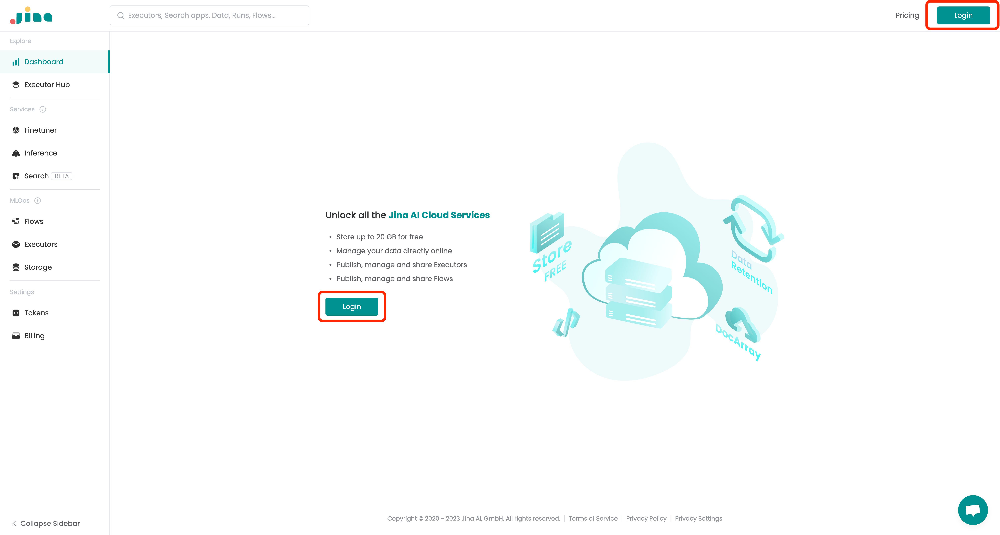
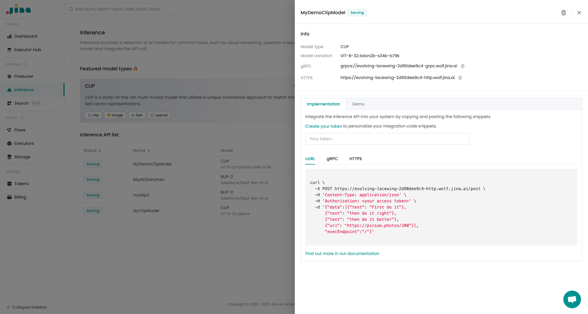

# Creating a Model

Jina AI Cloud provides a user-friendly interface for creating and managing your own AI models. 
Follow these steps to create a new model:

1. Log in to Jina AI Cloud at [cloud.jina.ai](https://cloud.jina.ai).



2. Navigate to the "Inference" tab in the left sidebar.
From here, you can see and manage all of your models you have created.
You can also try out the demo models to get a feel for how the models work.

 
 
3. Click the "Create" button to create a new model.
Fill out the form with the details of the model of your choice.


4. Once you have filled out the form, click the "Create" button to create the model.
This will take you to the Inference page, and you should see your model marked as "Serving" after a while.


You can also click on the model list item to see more details about the model, including the endpoints to access the model and a demo interface to try out the model.



```{note}
If you do not use your model for a while, it will be marked as "pause" and will be shut down to save resources.
You need to resume the model at the Inference page to use it again.
```